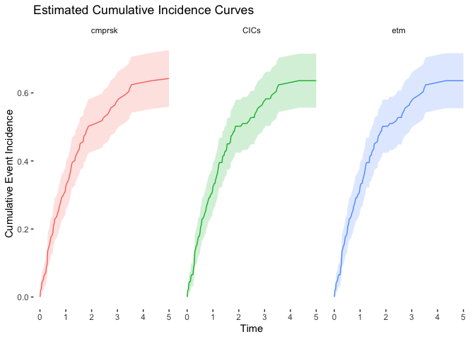
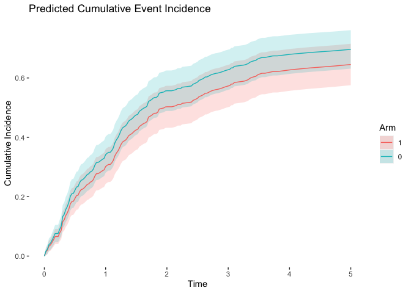

# Competing Risks


```r
library(CICs)
library(cmprsk)
library(dplyr)
library(etm)
library(ggplot2)
library(mstate)
library(survival)
library(tidyr)
source("Functions.R")
```

## Simulate Competing Risks Data


```r
# Arm 1.
n1 <- 200
data1 <- GenData(
  n = n1,
  censor_rate = 0.2,
  death_rate = 0.2,
  event_rate = 0.4,
  tau = 10
)
data1$arm <- 1
data1$id <- seq(from = 1, to = n1)

# Arm 0.
n0 <- 200
data0 <- GenData(
  n = n0,
  censor_rate = 0.2,
  death_rate = 0.2,
  event_rate = 0.5,
  tau = 10
)
data0$arm <- 0
data0$id <- seq(from = n1 + 1, to = n1 + n0)

data <- rbind(data1, data0)
```

## Estimation of Cumulative Incidence Curve


```r
# Method 1: using cmprsk.
fit1 <- cmprsk::cuminc(ftime = data1$time, fstatus = data1$status)
key <- !duplicated(fit1$`1 1`$est)
cic1 <- approxfun(x = fit1$`1 1`$time[key], y = fit1$`1 1`$est[key], rule = 2)
v1 <- approxfun(x = fit1$`1 1`$time[key], y = fit1$`1 1`$var[key], rule = 2)

# Method 2: using CICs.
fit2 <- CICs::CalcCIC(time = data1$time, status = data1$status)
cic2 <- approxfun(x = c(0, fit2$time), y = c(0, fit2$cic_event), rule = 2)
v2 <- approxfun(x = c(0, fit2$time), y = c(0, fit2$se_cic_event^2), rule = 2)

# Method 3: using etm.
fit3 <- etm::etm(
  data = data1,
  state.names = c("0", "1", "2"),
  tra = etm::tra_comp(),
  cens.name = "cens",
  s = 0
)
cic3 <- approxfun(x = c(0, fit3$time), y = c(0, fit3$est[1, 2, ]), rule = 2)
v3 <- approxfun(x = c(0, fit3$time), y = c(0, fit3$cov[4, 4, ]), rule = 2)
```

### Comparison of Estimators



## Cause-Specific Hazards


```r
# Cause-specific hazard of event.
cs1 <- survival::coxph(Surv(time, status == 1) ~ arm, data = data)
show(cs1)
```

```
## Call:
## survival::coxph(formula = Surv(time, status == 1) ~ arm, data = data)
## 
##        coef exp(coef) se(coef)      z     p
## arm -0.1537    0.8575   0.1375 -1.118 0.264
## 
## Likelihood ratio test=1.26  on 1 df, p=0.2625
## n= 400, number of events= 215
```

```r
# Cause-specific hazard of death.
cs2 <- survival::coxph(Surv(time, status == 2) ~ arm, data = data)
show(cs2)
```

```
## Call:
## survival::coxph(formula = Surv(time, status == 2) ~ arm, data = data)
## 
##        coef exp(coef) se(coef)     z     p
## arm 0.05328   1.05473  0.21493 0.248 0.804
## 
## Likelihood ratio test=0.06  on 1 df, p=0.8042
## n= 400, number of events= 88
```

Augmenting data to the format required for prediction.


```r
data2 <- rbind(data, data)
data2$trans <- rep(c(1, 2), each = nrow(data))
data2$status2 <- 1 * c(data$status == 1, data$status == 2)
data2$arm1 <- data2$arm * (data2$trans == 1)
data2$arm2 <- data2$arm * (data2$trans == 2)
show(data2[data2$id == 1, ])
```

```
##          time status from   to arm id trans status2 arm1 arm2
## 1   0.1835922      0    0 cens   1  1     1       0    1    0
## 401 0.1835922      0    0 cens   1  1     2       0    0    1
```

Recovery for individual cause-specific models using the augmented data.


```r
cs12 <- survival::coxph(Surv(time, status2) ~ arm1 + arm2 + strata(trans), data = data2)
show(cs12)
```

```
## Call:
## survival::coxph(formula = Surv(time, status2) ~ arm1 + arm2 + 
##     strata(trans), data = data2)
## 
##          coef exp(coef) se(coef)      z     p
## arm1 -0.15370   0.85753  0.13748 -1.118 0.264
## arm2  0.05328   1.05473  0.21493  0.248 0.804
## 
## Likelihood ratio test=1.32  on 2 df, p=0.5177
## n= 800, number of events= 303
```

### Prediction of Cumulative Incidence Curves


```r
# New case in arm 1.
new1 <- data.frame(
  arm1 = c(1, 0),
  arm2 = c(0, 1),
  strata = c(1, 2)
)

# New case in arm 0.
new0 <- data.frame(
  arm1 = c(0, 0),
  arm2 = c(0, 0),
  strata = c(1, 2)
)

# Transition matrix.
tmat <- mstate::trans.comprisk(2) # Note that "strata" must align with tmat.

# Prediction of transition hazards.
pred1 <- mstate::msfit(object = cs12, newdata = new1, trans = tmat)
pred0 <- mstate::msfit(object = cs12, newdata = new0, trans = tmat)

# Prediction of transition probabilities.
prob1 <- mstate::probtrans(object = pred1, predt = 0)[[1]]
prob0 <- mstate::probtrans(object = pred0, predt = 0)[[1]]

# Predicted cumulative incidence curves.
cic1 <- approxfun(x = prob1$time, y = prob1$pstate2)
cic0 <- approxfun(x = prob0$time, y = prob0$pstate2)

# Prediction uncertainty.
ses1 <- approxfun(x = prob1$time, y = prob1$se2)
ses0 <- approxfun(x = prob0$time, y = prob0$se2)
```


