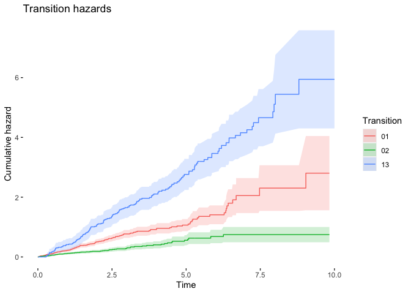
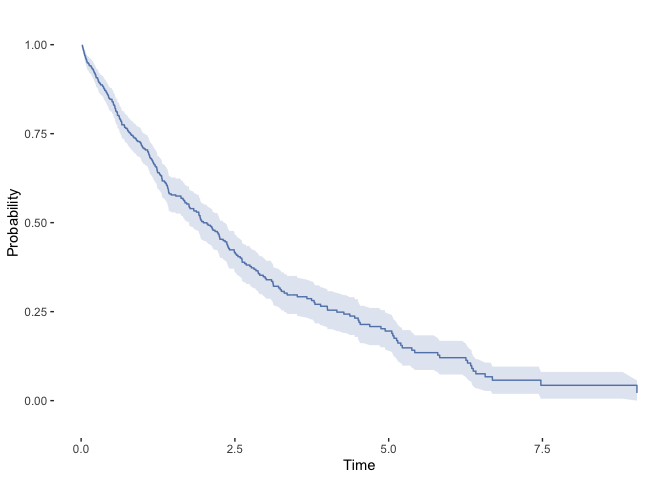
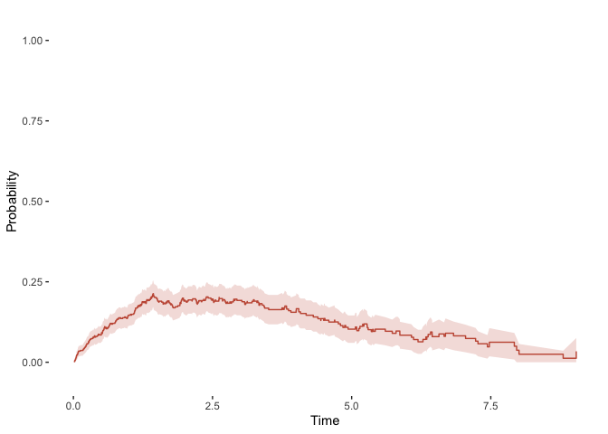
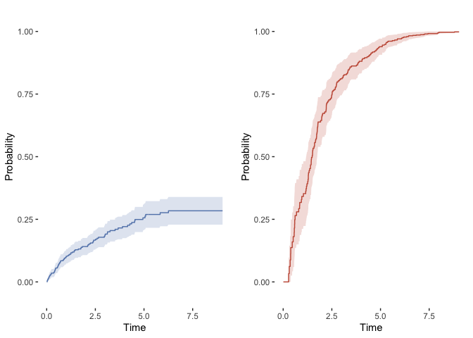

# Multistate Models


```r
library(cowplot)
library(ggplot2)
source("Functions.R")
```

## Simulate Illness-Death Data

Note that death without illness is coded as 2, while death after illness is coded as 3. 


```r
# Simulate data.
data <- SimData(
  n = 500,
  rate_c = 0.25,
  rate_01 = 0.25,
  rate_02 = 0.10,
  rate_12 = 0.50,
  tau = 10
)

head(data)
```

```
##   id      entry       exit from   to status
## 1  1 0.00000000 1.66709099    0    1      1
## 2  1 1.66709099 4.07349977    1 cens      0
## 3  2 0.00000000 0.05864361    0    1      1
## 4  2 0.05864361 2.93818196    1    3      1
## 5  3 0.00000000 0.31622087    0 cens      0
## 6  4 0.00000000 1.91329311    0    1      1
```

## Hazard Curves

### Transition Matrix


```r
# Transition matrix.
states <- c("0", "1", "2", "3")
tmat <- array(FALSE, dim = c(4, 4), dimnames = list(states, states))
tmat[1, 2] <- TRUE
tmat[1, 3] <- TRUE
tmat[2, 4] <- TRUE
show(tmat)
```

```
##       0     1     2     3
## 0 FALSE  TRUE  TRUE FALSE
## 1 FALSE FALSE FALSE  TRUE
## 2 FALSE FALSE FALSE FALSE
## 3 FALSE FALSE FALSE FALSE
```

### Multivariate Nelson-Aalen Estimator


```r
library(mvna)
# Estimate cumulative hazard.
haz <- mvna(
  data = data,
  state.names = states,
  tra = tmat,
  cens.name = "cens"
)
```

### Plot Cumulative Hazards


```r
# Prepare data.
df01 <- haz$`0 1`
df01$trans <- "01"
df02 <- haz$`0 2`
df02$trans <- "02"
df13 <- haz$`1 3`
df13$trans <- "13"
df <- rbind(df01, df02, df13)

# Plot cumulative hazards.
q_haz <- PlotHazardCurves(
  df = df,
  title = "Transition hazards",
  y_lab = "Cumulative hazard"
)
show(q_haz)
```



## Transition Matrix

### Aalen-Johansen Estimator


```r
library(etm)
pmat <- etm(
  data = data,
  state.names = states,
  tra = tmat,
  cens.name = "cens",
  s = 0
)
```

### Survival Curve

Probability of remaining in state 0.


```r
# Survival curve for state 0.
q_00 <- PlotProbCurve(
  probs = pmat$est[1, 1, ],
  ses = sqrt(pmat$cov[1, 1, ]),
  times = pmat$time
)
show(q_00)
```



### Response Curve

Probability of occupying the transient state 1.


```r
# Occupancy of transient state.
q_01 <- PlotProbCurve(
  probs = pmat$est[1, 2, ],
  ses = sqrt(pmat$cov[5, 5, ]),
  times = pmat$time,
  color = "#C65842"
)
show(q_01)
```



### Cumulative Incidence Curves

The 0 $\to$ 2 transition competes with the 0 $\to$ 1 transition, while the 1 $\to$ 3 transition has no competition. 


```r
# Cumulative incidence of state 0 -> 2.
q_02 <- PlotProbCurve(
  probs = pmat$est[1, 3, ],
  ses = sqrt(pmat$cov[9, 9, ]),
  times = pmat$time
)

# Cumulative incidence of state 1 -> 3.
q_13 <- PlotProbCurve(
  probs = pmat$est[2, 4, ],
  ses = sqrt(pmat$cov[14, 14, ]),
  times = pmat$time,
  color = "#C65842"
)
q_ci <- plot_grid(q_02, q_13, nrow = 1)
show(q_ci)
```


